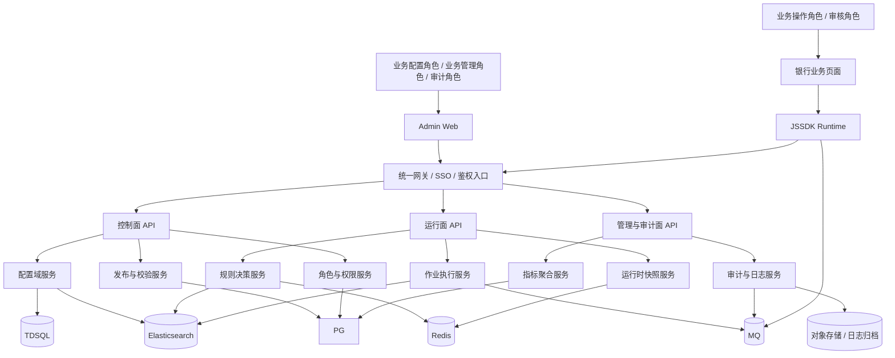
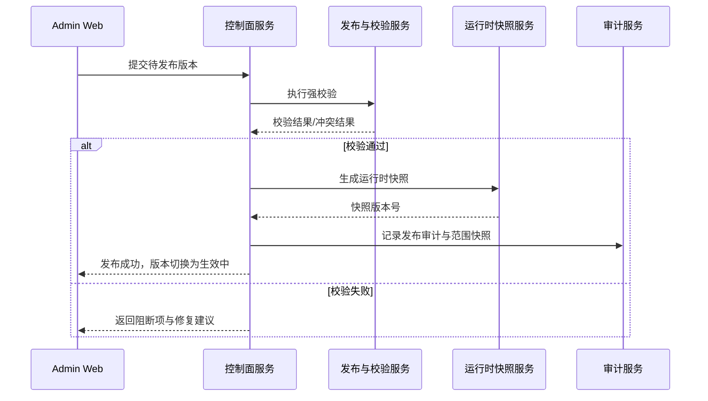
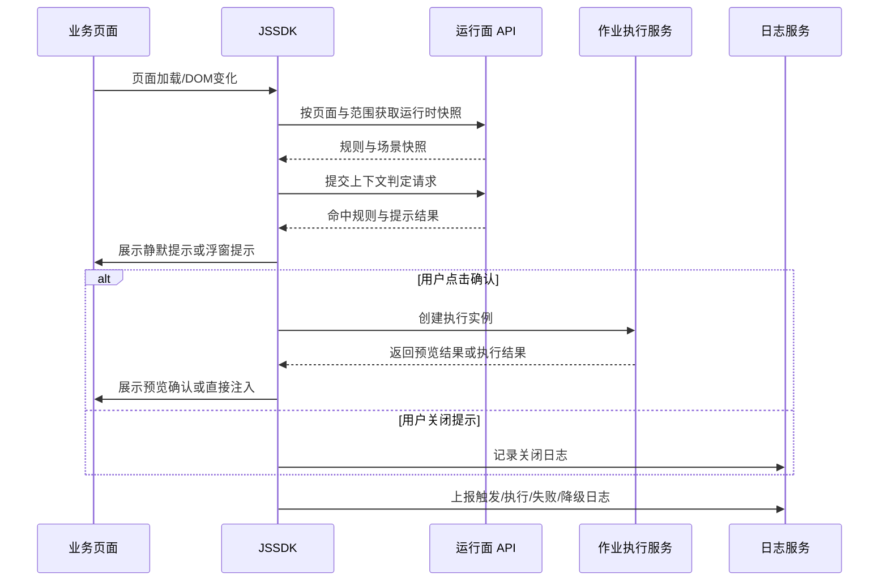

# 营小助配置中心架构设计

> 来源文档：`spec/config-center-product/prd-analysis.md`、`spec/config-center-product/plan.md`、`spec/config-center-product/permission-model.md`  
> 用户规模：约 10,000 内部用户  
> 当前仓库状态：当前工作区主要承载 `config-center-admin-web` 原型前端  
> 目标架构形态：控制面、运行面、管理与审计面解耦，Admin Web / Backend / JSSDK 三端分离  
> 部署形态：行内 Docker 独立部署，统一接入行内中间件与认证体系  
> 更新日期：2026-03-14
> 数据库基线：`TDSQL`（默认按 `TDSQL-MySQL` 单库或普通集群场景设计；若实际为 TDSQL-PG，仅切换 DDL 方言，不改变对象模型）
> 关联专题：`spec/config-center-product/api-design.md`、`spec/config-center-product/tdsql-ddl-draft.md`、`spec/config-center-product/jssdk-design.md`

## 1. 架构定位

营小助配置中心不是单一的提示后台，也不是孤立的作业引擎，而是一套面向银行内网页面的智能辅助平台。

架构设计必须同时支撑以下三类能力：

1. 公共支撑层：页面资源、名单数据、接口定义、预处理器、角色与权限、版本与审计。
2. 智能提示层：页面识别、规则匹配、提示渲染、关闭控制、提示确认入口。
3. 智能作业层：场景编排、节点执行、预览确认、页面注入、失败降级、二次触发。

同时，架构必须遵守新版产品边界：

1. 不替代业务系统原生审批流和最终确认动作。
2. 不依赖运行时业务冲突仲裁作为主防线，冲突必须在发布前消解。
3. 不以开放脚本自由度为目标，自定义脚本只作为受控增强项。
4. 不把平台内置完整联调测试能力作为 P0 能力承诺。
5. 出现异常时必须支持降级到人工路径，不能阻断业务继续办理。

## 2. 设计目标与非目标

### 2.1 设计目标

1. 支撑 10,000 内部用户规模下的稳定运行，运行面与控制面解耦，支持水平扩展。
2. 让业务角色成为主要配置者和主要发布/风险责任承担者，技术角色聚焦平台支撑和异常排查。
3. 以发布前强校验、版本替换、责任人绑定、风险确认和全链路留痕作为平台控制底线。
4. 形成 `页面资源 -> 规则触发 -> 提示引导 -> 作业执行 -> 发布控制与审计` 的完整技术闭环。
5. 支撑首批试点页面快速落地，并可按菜单、组织范围和模板能力逐步扩面。

### 2.2 非目标

1. 不建设通用低代码平台或高自由度画布产品。
2. 不支持以单页面、单规则、单场景为常规模式的细粒度 ACL 授权体系。
3. 不把提示中心做成多按钮、多动作分发平台。
4. 不把真实链路联调和页面注入最终验证放进平台内核能力中。

## 3. 总体架构视图

### 3.1 分层与分面

总体采用“三层能力 + 三个平面”的组合架构：

1. 能力层：公共支撑层、智能提示层、智能作业层。
2. 平面划分：控制面、运行面、管理与审计面。
3. 端形态：Admin Web、Backend、JSSDK。

其中：

1. 控制面负责页面、规则、作业、接口、预处理器和角色配置，以及发布、停用、回滚、风险确认。
2. 运行面负责页面识别、规则判断、提示渲染、作业执行、失败降级和运行时快照消费。
3. 管理与审计面负责状态变更审计、触发日志、执行日志、指标聚合、待处理视图和问题定位。

### 3.2 总体架构图

### 3.3 技术关键点

1. 控制面与运行面解耦，避免配置事务链路影响页面现场响应。
2. 发布动作不直接给运行面读控制面配置，而是生成运行时快照或运行视图。
3. JSSDK 以“本地规则运行 + 强约束”为原则，后端负责运行时快照发布、数据代理、审计留痕和平台控制校验。
4. 名单数据采用“元数据在 TDSQL、检索明细在 Elasticsearch”的分层方案：控制面负责版本控制与索引发布，运行面负责基于已发布索引做受控检索。
5. 状态变更日志和运行日志分流采集，通过 MQ 异步削峰，避免阻塞现场操作。
6. JSSDK 通过 CDN 分发时，CDN 只改善资源分发与缓存命中，不降低浏览器本地解析、执行与 DOM 处理成本，因此运行面必须采用“统一宿主 + 分包加载”而非提示与作业全量大包。

## 4. 部署与项目划分

### 4.1 目标三端划分

1. `config-center-admin-web`
   面向业务配置、业务发布管理和审计查看。
2. `config-center-backend`
   承载控制面、运行面、管理与审计面 API 以及统一领域服务。
3. `config-center-jssdk`
   注入业务页面，负责页面上下文采集、本地规则运行、提示展示、执行入口承接和埋点回传。

### 4.2 当前工作区与目标关系

当前仓库实际是配置端原型工程，技术栈已明确为：

1. `React 18`
2. `TypeScript 5`
3. `Vite 7`
4. `antd 5`
5. `react-router-dom 6`
6. `zustand 5`
7. `styled-components 6`

当前 `src` 目录中已存在 `pages`、`components`、`services`、`store`、`runtime`、`validation` 等目录，可继续作为 Admin Web 的演进基础。

### 4.3 Docker 部署建议

1. `config-center-backend:<version>`
   后端 API 容器，建议起步 3 副本。
2. `config-center-admin-web:<version>`
   管理端静态资源容器，建议起步 2 副本。
3. `config-center-jssdk:<version>`
   SDK 静态资源分发容器，建议起步 2 副本，并保留最近 2 个稳定版本。
4. TDSQL、Elasticsearch、Redis、MQ、对象存储优先复用行内统一中间件能力。
5. 三端独立构建、独立发布、独立回滚，避免跨端强耦合上线。

### 4.4 JSSDK 静态资源分发建议

1. JSSDK 以稳定入口 `cc-sdk-loader.js` 作为统一注入脚本，由 `loader` 在运行时解析出实际 `cc-sdk-core.<version>.js`。
2. 运行面发布后生成 `manifest + sdk-release-index + page-index + page-config + scene-config` 五层静态资源，业务页面只感知 `loader` 或稳定 manifest 地址。
3. 静态资源文件名必须带版本号或内容哈希，并使用长缓存；`loader` 与最新 manifest 允许短缓存或重新校验，升级通过新 URL 或槽位切换完成。
4. `loader/core` 负责版本解析、模块加载、兼容校验和缓存复用，业务系统不直接拼装内部模块 URL。

## 5. 控制面、运行面、管理与审计面模块划分

### 5.1 Admin Web 模块

1. 页面资源中心
   负责站点、专区、菜单、页面、元素建档与版本管理。
2. 规则中心
   负责规则创建、单层条件配置（全局 AND/OR）、提示配置与优先级设置。
3. 名单数据中心
   负责名单资产、导入解析、导入字段 / 输出字段、引用关系和版本控制。
4. 作业场景中心
   负责场景基础信息、节点编排、执行方式、预览模板和基础校验。
5. 接口定义中心
   负责接口版本、参数来源、出参路径、统一策略和引用关系展示。
6. 预处理器中心
   负责内置预处理能力配置与受控扩展管理。
7. SDK 版本中心
   负责 SDK 制品版本登记、灰度槽位维护、菜单版本策略查看与回滚。
8. 发布工作台
   默认进入待处理视图，承接发布、停用、延期、回滚、冲突处理和风险确认。
9. 角色管理模块
   负责角色复制、停用/恢复、组织范围配置、操作类型授权和人员批量分配。
10. 审计与指标中心
   提供状态变更日志、触发日志、执行日志和核心指标查询。

### 5.2 Backend 模块

#### 5.2.1 控制面服务

1. `page-resource-service`
   维护页面资源、页面版本、元素映射和资源共享关系。
2. `rule-service`
   维护规则、规则版本、条件组、提示配置和作业绑定关系。
3. `list-data-service`
   维护名单对象、名单版本、导入解析、导入字段 / 输出字段、有效期、ES 索引构建 / 别名切换和引用关系。
4. `job-scene-service`
   维护作业场景、场景版本、节点定义、执行方式和预览配置。
5. `interface-service`
   维护接口定义、参数来源、响应映射和统一调用策略。
6. `preprocessor-service`
   维护内置预处理器与受控扩展元数据。
7. `sdk-release-service`
   维护 SDK 制品版本、版本槽位、菜单版本策略、机构灰度范围和版本兼容校验。
8. `publish-validation-service`
   负责发布前强校验、冲突扫描、依赖检查和例外确认。
9. `role-permission-service`
   负责角色模板、组织范围、操作类型授权、人员绑定和权限校验。

#### 5.2.2 运行面服务

1. `runtime-snapshot-service`
   负责发布后生成运行时快照，按页面、组织范围、角色和版本投放给运行面，并下发页面字段元数据、元素类型、locator、执行方式、名单字段元数据等运行信息；对外输出时需拆分为 `manifest`、`sdk-release-index`、`page-index`、`page-config`、`scene-config` 等可缓存静态资源。
2. `runtime-data-proxy-service`
   负责运行时数据代理、名单检索代理、鉴权、限流、缓存策略下发以及接口调用 / 名单检索审计；其中名单检索直接面向已发布 ES 索引执行。
3. `scene-execution-service`
   负责作业实例创建、节点串行执行、`list_lookup` / 接口调用 / 页面写值等节点承接、预览结果生成、页面注入请求和失败处理。
4. `runtime-guard-service`
   负责最小化技术防护，例如重复写入拒绝、脏上下文拒绝和运行时异常隔离。

#### 5.2.3 管理与审计面服务

1. `state-change-audit-service`
   记录发布、停用、延期、回滚、角色调整、风险确认等状态变更动作。
2. `trigger-log-service`
   记录规则命中、未命中、字段缺失、接口异常、提示关闭等现场日志。
3. `execution-log-service`
   记录作业实例、节点输入输出、耗时、失败原因和重试情况。
4. `metrics-service`
   聚合执行成功率、平均节省时长、失败原因分布、已失效数量和即将到期数量等指标。

### 5.3 JSSDK 模块

JSSDK 的运行面专题设计、接入模式、缓存策略与页面读写约束，详见 `spec/config-center-product/jssdk-design.md`。

1. `loader`
   稳定入口脚本，负责基于 `appId + env + regionId + menuCode + orgId` 解析菜单级 SDK 版本槽位并加载目标 `core`。
2. `core`
   宿主运行时，承接初始化、上下文采集、页面识别、`page-index/page-config` 拉取、本地规则判定、模块加载与埋点。
3. `prompt`
   智能提示模块，在页面确认启用提示后动态加载，负责静默提示、浮窗提示、关闭行为和提示确认交互。
4. `job`
   智能作业模块，不进入首包；当页面确认存在作业场景后按策略预热，在真正执行时创建实例。
5. `preview`
   预览确认模块，只在场景要求确认预览时加载，负责字段对照、勾选写入和异常标识。
6. `shared runtime primitives`
   页面字段模型、`locator` 解析、DOM 变化信号接入、缓存与埋点基础设施统一沉淀在 `core`，避免 `prompt` 与 `job` 重复打包。

JSSDK 的加载原则如下：

1. 页面进入后先由 `loader` 解析菜单命中的 SDK 版本并加载 `core`，随后 `core` 再做轻量识别和索引判断。
2. 页面确认启用提示后再加载 `prompt`。
3. 页面配置声明存在作业场景时，`job` 按 `immediate / idle / intent / none` 策略预热，默认推荐 `idle`。
4. `preview` 比 `job` 更晚，只在进入预览确认链路时加载。
5. 模块下载与实例化分离：允许预下载，但只有真正进入链路时才创建运行实例。

## 6. 关键架构决策

### 6.1 页面资源作为唯一页面底座

1. 页面、元素、识别规则必须统一在页面资源域维护。
2. 规则和作业场景都只引用页面资源，不直接私有维护选择器。
3. 页面结构变化时，只允许在页面资源层修复，不允许在规则或作业层各自打补丁。
4. 页面字段在页面资源层统一建模，并区分公共字段、页面特有字段、元素类型和 locator。
5. 页面资源层级固定为 `site -> region -> menu -> page`；菜单的父级统一使用 `regionId` 表达，不再使用 `parentMenuCode`。

### 6.2 规则和作业场景分开建模

1. 规则回答“什么时候触发”。
2. 作业场景回答“触发后做什么”。
3. 两者独立版本化、独立发布控制，通过绑定关系协同。
4. 规则名称、作业场景名称均要求全局唯一，不单独建设业务编码字段。

### 6.3 发布后生成运行时快照

1. 运行面不直接读取控制面草稿数据。
2. 发布动作生成按范围裁剪后的运行时快照，供 JSSDK 和运行面服务读取。
3. 快照中只保留现场执行所需最小信息，避免泄露不必要的控制元数据；名单检索仅下发条件元数据，不下发原始名单内容。
4. 快照支持版本号和 ETag，用于缓存、灰度和快速回退。
5. 快照需包含页面字段元数据、元素类型、locator、字段依赖索引、执行方式配置、名单版本标识和必要的字段提取策略。

### 6.4 先索引判定，再按需加载

1. 运行面必须先下发小体积 `page-index`，用于判断“当前页面是否可能启用提示或作业”，而不是让页面首包直接拉取全量提示与作业配置。
2. 页面识别优先依赖业务系统显式提供的 `pageCode/moduleCode` 等稳定标识，路由和 DOM 标记仅作兜底。
3. 只有命中“应用启用、页面命中、用户命中、灰度命中、DOM 稳定”后，JSSDK 才继续加载 `prompt`。
4. 只有页面配置明确存在作业场景时，JSSDK 才允许预热 `job`。

### 6.5 菜单级 SDK 版本控制

1. SDK 版本控制绑定到菜单层级，页面与 iframe 默认继承所属菜单的 SDK 版本，不单独配置页面级 SDK 版本。
2. 菜单的父级为专区，因此菜单策略主键应以 `regionId + menuCode` 作为业务定位基础，而不是菜单树上的 `parentMenuCode`。
3. 技术人员负责发布不可变 SDK 制品版本并维护 `stable`、`gray-a` 等版本槽位；菜单能力配置属于特殊权限，默认仅业务超管或被授权菜单开通管理员可选择槽位，不向普通业务配置人员开放。
4. 所有菜单默认已预注入 JSSDK；业务侧真正需要控制的是菜单是否启用智能提示 / 智能作业，以及机构范围和 IP 试点范围。机构仍是正式灰度主维度，IP 仅用于小范围试点验证；运行时按 `orgId` 与可选 IP 白名单共同命中菜单策略。
5. 若菜单未配置专属策略，可按“菜单策略 -> 专区默认策略 -> 应用稳定槽位”顺序回退。
6. 同一菜单会话内的主页面与嵌套 iframe 必须使用同一 SDK 版本，避免跨 iframe 版本漂移导致排障困难。

### 6.6 冲突在发布前消解，运行时只做技术防护

1. 同页同字段写入冲突必须在发布前扫描并阻断。
2. 运行时若因缓存滞后、灰度残留或脏上下文导致重复写入尝试，只做拒绝、留痕和降级。
3. 运行面不承担业务仲裁职责，避免线上出现不可解释行为。

### 6.7 平台只提供基础校验，不承诺完整测试能力

1. 规则配置采用行内编辑与保存前校验，不提供独立规则预览面板。
2. 作业场景仅支持基础校验，不内置完整真实链路联调能力。
3. 外部系统联调、页面真实注入验证和最终结果确认必须在真实业务环境完成。

## 7. 数据模型建议

### 7.1 公共支撑层

| 表名 | 关键字段 | 说明 |
| --- | --- | --- |
| `page_site` | `id`, `name`, `status` | 监控网站或业务系统定义 |
| `page_region` | `id`, `site_id`, `region_code`, `region_name`, `status` | 专区定义，菜单的直接父级 |
| `page_menu` | `id`, `site_id`, `region_id`, `menu_code`, `menu_name`, `status` | 业务菜单，使用 `region_id` 归属专区 |
| `page_resource` | `id`, `menu_id`, `page_code`, `frame_code`, `name`, `status`, `owner_org_id` | 页面资源主表 |
| `page_resource_version` | `id`, `page_resource_id`, `version_no`, `state` | 页面资源版本 |
| `page_element` | `id`, `page_resource_version_id`, `logic_name`, `selector`, `selector_type` | 页面元素与逻辑名映射 |
| `interface_definition` | `id`, `name`, `status`, `owner_org_id` | 接口定义主表 |
| `interface_version` | `id`, `interface_definition_id`, `version_no`, `state` | 接口版本 |
| `interface_param` | `id`, `interface_version_id`, `param_name`, `source_type`, `required` | 接口参数来源配置 |
| `preprocessor_definition` | `id`, `name`, `processor_type`, `status` | 预处理器定义，优先内置能力 |
| `resource_share_record` | `id`, `resource_type`, `resource_id`, `share_mode`, `target_org_id` | 资源共享或复制关系 |

### 7.2 规则与提示层

| 表名 | 关键字段 | 说明 |
| --- | --- | --- |
| `rule` | `id`, `name`, `status`, `owner_org_id` | 规则主表，名称全局唯一 |
| `rule_version` | `id`, `rule_id`, `version_no`, `state`, `priority` | 规则版本，状态采用待发布/生效中/已停用/已失效 |
| `rule_condition_group` | `id`, `rule_version_id`, `parent_group_id`, `logic_type` | 条件组（数据层保留分组能力；当前前端仅开放单层） |
| `rule_condition` | `id`, `group_id`, `left_source`, `operator`, `right_source` | 条件定义 |
| `rule_preprocessor_binding` | `id`, `condition_id`, `side`, `preprocessor_id`, `order_no` | 左右值预处理链 |
| `rule_prompt_config` | `id`, `rule_version_id`, `prompt_mode`, `close_mode`, `content` | 提示模式、关闭策略、文案 |
| `rule_scene_binding` | `id`, `rule_version_id`, `job_scene_id`, `trigger_mode` | 规则与作业场景绑定 |

### 7.3 作业场景层

| 表名 | 关键字段 | 说明 |
| --- | --- | --- |
| `job_scene` | `id`, `name`, `status`, `owner_org_id` | 作业场景主表，名称全局唯一 |
| `job_scene_version` | `id`, `job_scene_id`, `version_no`, `state`, `execution_mode` | 场景版本与执行方式 |
| `job_node` | `id`, `job_scene_version_id`, `node_type`, `order_no`, `enabled` | 顺序节点定义 |
| `job_node_mapping` | `id`, `job_node_id`, `mapping_type`, `source_ref`, `target_ref` | 节点输入输出映射 |
| `job_preview_template` | `id`, `job_scene_version_id`, `field_name`, `source_ref`, `writable` | 预览确认字段对照 |
| `risk_confirmation_record` | `id`, `job_scene_version_id`, `confirmer_id`, `confirmed_at`, `scope_snapshot` | 自动执行风险确认记录 |
| `manual_time_baseline` | `id`, `job_scene_version_id`, `manual_duration_sec` | 人工作业时长基线 |

### 7.4 SDK 发布、控制与权限层

| 表名 | 关键字段 | 说明 |
| --- | --- | --- |
| `sdk_artifact_version` | `id`, `sdk_version`, `artifact_manifest_url`, `sdk_major_version`, `status` | 技术发布的不可变 SDK 制品版本 |
| `sdk_release_lane` | `id`, `lane_code`, `sdk_artifact_version_id`, `status` | SDK 版本槽位，如 `stable`、`gray-a` |
| `region_sdk_default_policy` | `id`, `site_id`, `region_id`, `stable_lane_id`, `status` | 专区级 SDK 默认策略，供菜单策略缺省回退 |
| `menu_sdk_policy` | `id`, `site_id`, `region_id`, `menu_code`, `stable_lane_id`, `gray_lane_id`, `gray_org_scope`, `effective_start`, `effective_end`, `status` | 菜单级 SDK 版本控制与机构灰度策略 |
| `page_activation_policy` | `id`, `page_resource_id`, `enabled`, `prompt_rule_set_id`, `has_job_scenes`, `job_preload_policy`, `status` | 页面启用策略，由业务人员管理 |
| `org_role` | `id`, `name`, `role_type`, `status`, `org_scope_id`, `source_role_id` | 组织内角色定义，支持复制 |
| `org_role_action` | `id`, `role_id`, `action_type` | 角色拥有的操作类型 |
| `org_role_member` | `id`, `role_id`, `user_id`, `status` | 角色与人员绑定 |
| `publish_task` | `id`, `resource_type`, `resource_id`, `target_version_id`, `status` | 发布任务 |
| `validation_record` | `id`, `publish_task_id`, `validation_type`, `result`, `details` | 发布前校验结果 |
| `state_change_audit_log` | `id`, `resource_type`, `resource_id`, `action_type`, `operator_id` | 状态变更审计日志 |

### 7.5 运行与指标层

| 表名 | 关键字段 | 说明 |
| --- | --- | --- |
| `runtime_snapshot` | `id`, `page_resource_id`, `owner_org_id`, `bundle_version`, `etag` | 运行时快照 |
| `runtime_execution_instance` | `id`, `job_scene_version_id`, `trigger_source`, `status`, `trace_id` | 作业执行实例 |
| `runtime_node_instance` | `id`, `execution_instance_id`, `job_node_id`, `status`, `input_snapshot`, `output_snapshot` | 节点执行快照 |
| `trigger_log` | `id`, `trace_id`, `rule_version_id`, `page_resource_id`, `result`, `reason` | 规则触发日志 |
| `execution_log` | `id`, `trace_id`, `execution_instance_id`, `node_id`, `result`, `reason`, `latency_ms` | 执行日志 |
| `metric_daily_org_menu` | `stat_date`, `org_id`, `menu_id`, `exec_success_cnt`, `avg_saved_sec`, `expired_cnt`, `soon_expire_cnt` | 核心运营指标日聚合 |

### 7.6 数据设计原则

1. 规则、页面、接口、作业场景都采用“主表 + 版本表 + 发布记录”模式。
2. 所有生效中对象修改时都创建新的待发布版本，禁止直接覆盖生效版本。
3. 规则和作业场景不设置业务编码字段，统一由系统内部主键和版本号管理。
4. 已使用角色和核心配置不做物理删除，统一采用软删除或停用。
5. 日志表按时间分区，热存与归档分离。
6. 所有业务表统一包含 `created_at`、`created_by`、`updated_at`、`updated_by`、`is_deleted` 等审计字段。
7. 当前不考虑分布式场景；核心主数据表可按 DBA 评审结果补充外键约束，日志大表与高变化配置表仍优先通过应用层校验和状态变更日志保证一致性。

## 8. 关键流程设计

### 8.1 发布流程

发布前必须至少校验：

1. 责任人是否存在。
2. 组织范围是否完整。
3. 生效时间和失效时间是否完整。
4. 同页同字段写入是否冲突。
5. 依赖页面、接口、预处理器是否有效。
6. 作业场景是否填写人工作业时长。
7. 自动执行类场景是否完成风险确认。

### 8.2 页面现场运行流程

### 8.3 二次触发与失败降级

1. 悬浮按钮仅在当前页面存在可执行场景时展示。
2. 每次悬浮按钮触发都新建执行实例，不复用旧上下文。
3. 接口失败、元素缺失、权限异常、页面变化等问题发生时，统一返回可理解错误并允许回退手工路径。
4. 失败默认停止后续节点，不静默吞错。

## 9. 生命周期与发布控制设计

### 9.1 主状态模型

规则、作业场景、页面资源、接口定义等核心对象统一采用以下主状态：

1. `待发布`
2. `生效中`
3. `已停用`
4. `已失效`

实现要求：

1. 新建对象默认进入待发布。
2. 发布成功后进入生效中。
3. 生效中对象可手工停用，进入已停用。
4. 到达失效时间或因替代退出时进入已失效。
5. 已停用和已失效对象如需重新使用，应基于当前或历史版本重新生成待发布版本。

### 9.2 版本替换机制

1. 生效中对象发生修改时，不直接更新当前线上版本。
2. 控制面自动创建新的待发布版本。
3. 新版本发布成功后，替代旧版本成为生效版本。
4. 回滚本质上是选定历史版本重新生成待发布版本并发布，不允许直接覆盖历史记录。

### 9.3 待处理视图支撑

发布工作台默认进入待处理视图，重点聚焦：

1. 待发布对象
2. 即将到期对象
3. 校验不通过对象
4. 存在冲突对象
5. 待风险确认对象

## 10. 权限与安全架构

### 10.1 权限模型实现边界

权限体系以 [permission-model.md](./permission-model.md) 为准，架构上只落实三个核心点：

1. 资源边界按组织范围控制。
2. 权限边界按操作类型控制。
3. 角色与人员、组织范围、操作类型的变更必须留痕。

### 10.2 标准角色映射建议

后端权限服务应直接支持以下标准角色模板：

1. 业务操作角色
2. 业务配置角色
3. 业务管理角色
4. 业务审计角色
5. 业务超管角色
6. 平台支持角色

角色复制后形成组织内独立角色，不影响模板和原角色。

### 10.3 安全控制点

1. 敏感字段、接口返回和日志内容必须按角色脱敏展示。
2. 页面侧不暴露密钥、完整控制元数据和不必要配置细节。
3. `js_script` 与自定义预处理器必须纳入受控发布、审计和灰度策略。
4. 自动执行场景必须绑定责任人、适用范围、有效期和风险确认记录。
5. 平台支持角色不参与业务发布和业务风险承担。

## 11. 可观测性与指标架构

### 11.1 必须记录的日志类型

1. 状态变更日志：发布、停用、延期、回滚、角色调整、风险确认。
2. 触发日志：页面识别结果、规则命中与未命中原因、提示关闭、确认点击。
3. 执行日志：执行实例、节点输入输出、耗时、失败原因、降级结果。

### 11.2 指标口径

架构默认优先支撑以下核心指标：

1. 作业执行成功率
2. 平均节省时长
3. 失败原因分布
4. 已失效规则/场景数量
5. 即将到期规则/场景数量

命中次数、提示展示次数等指标可以记录，但不作为 P0 核心价值指标。

### 11.3 存储与查询建议

1. 状态变更类日志保留高可查性，优先入库 TDSQL 或专用日志库。
2. 高吞吐运行日志通过 MQ 异步消费，按时间分区落库和归档。
3. 归档日志进入对象存储，支持按 traceId、规则版本、场景版本回查。
4. 指标聚合作业按自然日和组织/菜单维度离线汇总。

## 12. 容量、性能与稳定性建议

### 12.1 容量假设

1. 约 10,000 内部用户。
2. 峰值在线按 8% - 12% 估算，约 800 - 1,200 在线用户。
3. 高峰压力主要来自页面初始化、规则快照拉取、决策请求和日志上报。

### 12.2 性能设计要点

1. 运行时快照按页面、组织范围和角色裁剪，减小下发体积。
2. 快照读路径优先走 Redis 或边缘缓存，控制面写路径走 TDSQL。
3. 日志采集异步化，避免现场操作受阻。
4. 预处理器以内置能力优先，减少高成本脚本执行。
5. JSSDK DOM 操作必须幂等，避免重复注入和重复弹窗。

### 12.3 稳定性设计要点

1. 页面识别失败时，优先降级为仅记录日志，不误触发规则。
2. 接口超时或依赖异常时，统一返回失败原因并允许手工继续办理。
3. 发布快照必须支持快速回滚，避免错误配置长时间影响现场。
4. SDK 保留最近稳定快照和版本信息，便于短时网络波动下受控运行。

## 13. 推荐落地顺序

结合新版 [plan.md](./plan.md)，推荐按以下顺序落地：

1. 先完成页面资源、接口定义、预处理器、角色管理等公共支撑层建模。
2. 再完成规则与提示主链路，确保页面识别、条件判断、提示渲染和关闭行为一致。
3. 第三步完成作业场景、执行方式、预览确认和悬浮按钮二次触发。
4. 第四步完成发布前强校验、生命周期控制、待处理视图和风险确认流程。
5. 最后完成外部环境联调、灰度发布、回滚演练和指标运营收口。

## 14. 本版需要特别替换的旧口径

为避免架构文档继续沿用旧版本方案，本版明确替换以下旧口径：

1. 不再使用 rule_name / scene_name 之外的业务编码字段作为主标识，规则和场景仅保留名称字段。
2. 不再使用运行时业务冲突仲裁作为主方案，改为发布前强校验 + 运行时最小技术防护。
3. 不再将“节点拖拽 + 测试运行”定义为主编排模式，改为“流程图式主视图 + 结构化表单编辑 + 基础校验”。
4. 不再以命中率、采纳率作为 P0 核心价值指标，改为执行成功率、平均节省时长、失败原因分布、已失效数量、即将到期数量。
5. 不再把 RBAC 设计成细粒度资源 ACL，改为组织范围控制资源边界、操作类型控制权限边界的简化模型。
6. 规则编辑交互从多层条件组收敛为单层条件表格，所有条件共享全局 AND/OR，预处理器采用行内下拉多选。
7. 作业场景中心当前不展示执行实例与手工预览，编排交互采用左（节点库）-中（画布）-右（属性）布局，并提供自动排版能力。

