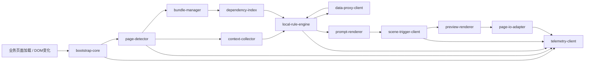

# 营小助配置中心 JSSDK 设计专题

> 关联总纲：`spec/config-center-product/prd-analysis.md`  
> 关联架构：`spec/config-center-product/architecture.md`  
> 关联接口：`spec/config-center-product/api-design.md`  
> 关联子文档：`spec/config-center-product/sentinel-prd.md`、`spec/config-center-product/job-prd.md`  
> 文档目标：补全 JSSDK 在运行面中的职责、模块拆分、缓存策略、提示与作业链路、埋点控制与接入约束  
> 更新日期：2026-03-14

## 1. 文档定位

本文是营小助配置中心在“运行面”上的专题设计文档，专门回答以下问题：

1. JSSDK 在整体平台中的职责边界是什么。
2. JSSDK 如何接入业务页面并完成初始化。
3. JSSDK 如何完成页面识别、上下文采集、规则触发、提示渲染、作业执行和埋点上报。
4. JSSDK 如何在异常、网络波动、页面变化等情况下保持可控降级。

本文不替代：

1. 平台总纲中的产品边界定义。
2. 后端运行面 API 的正式契约。
3. 智能提示与智能作业的产品细则。

## 2. 核心定位与边界

### 2.1 核心定位

JSSDK 是配置中心在业务现场的“受控本地运行时引擎”，负责把后台发布后的运行时快照带到页面现场，并在当前用户、当前页面、当前上下文下承接以下能力：

1. 页面识别。
2. 页面上下文采集。
3. 规则本地判定与增量重算。
4. 提示展示、页面会话内去重与关闭行为承接。
5. 数据代理调用、本地接口缓存与受控预处理。
6. 作业触发、预览确认与页面注入承接。
7. 运行时事件与异常上报。

### 2.2 设计原则

1. 本地判定：所有规则运算在 JSSDK 本地完成，后端只负责运行时快照发布、数据代理、审计留痕和平台控制校验。
2. 强约束：JSSDK 只消费已发布运行快照，不读取草稿配置。
3. 声明式执行：规则、依赖索引和预处理流程在发布时编译为声明式结构，客户端不执行自由脚本或 `eval`。
4. 基线终态：SDK 就绪后必须先对监控字段完成一次基线采样，建立当前页面终态快照，避免页面先稳定后 SDK 才初始化导致漏判。
5. 字段驱动：规则对外始终由页面字段变化驱动；对于 `READONLY_TEXT` 等字段，DOM 变化只作为刷新字段值的内部信号。
6. 增量重算：后续重算只处理已观测到的终态字段变化，并且必须去抖、串行、按受影响规则子集计算；未观测到的历史变化不做补偿。
7. 可降级：任何异常都优先退回人工路径，不阻断业务办理。
8. 最小暴露：页面侧不暴露敏感配置和密钥，不下发不必要控制元数据。

### 2.3 非目标

1. 不在 JSSDK 中开放自由脚本平台。
2. 不允许客户端执行任意脚本型预处理器。
3. 不把 JSSDK 做成页面自动化测试工具。
4. 不承担运行时业务冲突仲裁职责。
5. 不允许浏览器直接访问内部业务接口或暴露敏感凭证。
6. 不承诺覆盖所有跨域 iframe 或极端页面框架差异场景。

## 3. 接入形态与部署建议

### 3.1 推荐接入模式

推荐按优先级支持两种模式：

1. 网关或统一门户注入  
   由行内统一网关、门户壳或公共前端基座按站点白名单注入 SDK 脚本，是 P0 推荐模式。
2. 业务页面手工引入  
   由目标业务系统在页面模板中显式引入 SDK 脚本，作为补充接入模式。

### 3.2 初始化方式

建议同时支持：

1. 自动初始化  
   页面存在 `window.__CC_SDK_CONFIG__` 时自动启动。
2. 手工初始化  
   业务系统显式调用 `ConfigCenterSDK.bootstrap(config)`。

### 3.3 版本发布

1. JSSDK 独立版本化、独立构建、独立回滚。
2. CDN 场景下页面默认只加载稳定入口 `cc-sdk-loader.js`，由 `loader` 在运行时解析实际 `cc-sdk-core.<version>.js`，其余能力按模块拆分。
3. 保留最近 2 个稳定版本，便于短时快速回退。
4. SDK 主版本变更时，运行时快照需记录兼容范围，避免旧脚本消费新快照失败。
5. 静态资源文件名必须带显式版本号或内容哈希，升级通过新 URL 发布，不覆盖旧资源。

### 3.4 CDN 分发建议

针对“统一宿主 SDK 通过 CDN 分发”的前提，建议将运行时分发物拆成“宿主脚本 + 配置索引 + 页面快照 + 场景快照”四层：

1. 稳定入口脚本  
   `cc-sdk-loader.js`，负责解析当前菜单命中的 SDK 版本槽位并加载目标 `core`。
2. 宿主与能力脚本  
   `cc-sdk-core.<version>.js`、`cc-sdk-prompt.<version>.js`、`cc-sdk-job.<version>.js`、`cc-sdk-preview.<version>.js`
3. 运行时清单  
   例如 `/manifest/{appId}/{env}/latest.json`，用于声明当前业务系统可用的索引 URL、模块资源 URL 与兼容信息。
4. SDK 发布索引  
   例如 `sdk-release-index.<hash>.json`，用于按 `regionId + menuCode + orgId` 解析当前菜单命中的版本槽位和实际 SDK 版本。
5. 页面级索引  
   例如 `page-index.<hash>.json`，仅保存“当前页是否可能启用智能提示/作业”的最小信息。
6. 详细配置  
   例如 `pages/{pageCode}.{hash}.json`、`job-scenes/{sceneId}.{hash}.json`，按页面和场景按需拉取。

### 3.5 CDN 缓存策略

1. 版本化 JS 与 JSON 静态资源统一走 CDN 长缓存，推荐 `Cache-Control: public, max-age=31536000, immutable`。
2. `cc-sdk-loader.js` 与最新 manifest 允许短缓存或 ETag 重新校验，以便及时获取新的版本槽位映射。
3. 业务页面只引用稳定入口，实际 `core/prompt/job/preview` 资源地址由 `loader/core` 解析得到。
4. 配置中心发布后先生成新版本静态资源，再原子切换 manifest 与版本槽位映射，避免页面拿到不一致资源。

### 3.6 菜单级版本控制与机构灰度

1. SDK 版本控制绑定到菜单层级，页面与 iframe 默认继承所属菜单的 SDK 版本；菜单的父级统一使用 `regionId` 表达，不再使用 `parentMenuCode`。
2. 技术人员负责发布不可变 SDK 制品版本，并维护 `stable`、`gray-a`、`gray-b` 等版本槽位。
3. 所有菜单默认已预注入 JSSDK；业务侧不配置“是否注入 JSSDK”，只在具备特殊权限时配置菜单是否启用智能提示 / 智能作业，以及菜单命中的槽位、机构范围和 IP 试点范围。
4. 运行时版本解析键建议固定为 `appId + env + regionId + menuCode + orgId`。
5. 若菜单未命中独立策略，可按“菜单策略 -> 专区默认策略 -> 应用稳定槽位”顺序回退。
6. 同一菜单会话内的主页面与嵌套 iframe 必须使用同一 SDK 版本。

## 4. 运行时总体架构

### 4.1 模块划分

在 `architecture.md` 已定义的主模块基础上，JSSDK 建议细化为以下 12 个运行组件：

1. `bootstrap-core`  
   负责初始化、配置读取、生命周期管理、全局单例控制。
2. `context-collector`  
   负责字段、用户、组织、菜单、URL、业务标识采集。
3. `page-detector`  
   负责页面识别与页面变更感知。
4. `bundle-manager`  
   负责运行时快照拉取、缓存、ETag 校验与失效处理。
5. `dependency-index`  
   负责构建字段到规则的依赖索引、监听图和受影响规则子集。
6. `local-rule-engine`  
   负责规则本地执行、增量重算、命中去重与串行控制。
7. `data-proxy-client`  
   负责按接口定义发起受控数据代理请求，并承接 TTL、in-flight 去重和缓存复用。
8. `prompt-renderer`  
   负责静默提示、浮窗提示、关闭与确认交互。
9. `scene-trigger-client`  
   负责作业实例创建、状态查询、重试、取消。
10. `preview-renderer`  
   负责预览确认页渲染、字段勾选、确认写入。
11. `page-io-adapter`  
   负责页面取值、页面写值和写后校验。
12. `telemetry-client`  
   负责触发、关闭、执行、失败、降级事件上报。

### 4.2 逻辑模块与物理分包映射

上述 12 个组件是逻辑职责划分，物理发布时建议收敛为 4 个脚本分包：

1. `core`  
   包含 `bootstrap-core`、`context-collector`、`page-detector`、`bundle-manager`、`dependency-index`、`local-rule-engine`、`telemetry-client` 以及模块加载器。
2. `prompt`  
   包含 `prompt-renderer`、提示态本地交互和最小 UI 容器。
3. `job`  
   包含 `scene-trigger-client`、作业实例管理、执行状态承接和 `page-io-adapter`。
4. `preview`  
   包含 `preview-renderer`、字段差异展示和确认交互。
5. 公共字段模型、`locator` 解析、DOM 变化信号接入、缓存与埋点基础设施统一沉淀在 `core`，避免 `prompt` 与 `job` 重复打包。
6. 物理分包必须做到“下载”和“实例化”分离：模块可预下载，但只有在真正进入对应链路时才创建运行实例。

### 4.3 主运行数据流



### 4.4 运行状态机

建议 JSSDK 内部统一维护如下状态：

1. `IDLE`：未启动。
2. `BOOTSTRAPPING`：初始化中。
3. `RESOLVING_PAGE`：页面识别中。
4. `PROMPT_PREPARING`：已确认当前页可能启用提示，正在加载 `prompt` 模块与页面详细配置。
5. `READY`：已拿到页面快照并构建本地依赖图，可进入判定。
6. `EVALUATING`：本地规则判定中。
7. `PROMPTING`：提示展示中。
8. `JOB_PRELOADING`：页面存在作业场景，正在按策略预加载 `job` 模块。
9. `EXECUTING`：作业执行中。
10. `DEGRADED`：运行受限，仅保留最小能力或只做留痕。
11. `DESTROYED`：已卸载。

## 5. 初始化与生命周期设计

### 5.1 启动时序

建议启动顺序如下：

1. `loader` 读取初始化配置。
2. 采集版本解析所需最小上下文：站点、`regionId`、`menuCode`、URL、组织、环境。
3. 拉取运行时 manifest 与 `sdk-release-index`，按 `appId + env + regionId + menuCode + orgId` 解析目标 SDK 版本槽位和实际 `core` 版本。
4. 加载目标 `cc-sdk-core.<version>.js` 并注册全局单例，避免重复启动。
5. `core` 继续采集用户、角色、页面、字段所需上下文。
6. 在 SPA 场景中对路由变化做 `80ms ~ 150ms` 防抖，等待页面基础结构稳定。
7. 优先使用业务系统显式提供的 `pageCode/moduleCode` 识别页面，无法提供时再按路由和稳定 DOM 标记兜底。
8. 拉取 `page-index`，先判断“当前页面是否可能启用智能提示”。
9. 若索引未命中，则进入待机态，只保留轻量监听页面变化的能力。
10. 若索引命中，则并行加载 `cc-sdk-prompt.<version>.js` 和当前页面 `page-config`。
11. 构建字段依赖索引、字段快照、监听图和接口缓存索引。
12. 建立页面会话、字段监听订阅和脏队列。
13. 对监控字段做一次基线采样，建立当前页面终态快照。
14. 按规则配置基于当前终态发起首次本地判定，或仅记录基线等待后续变化。
15. 若 `page-config` 声明存在作业场景，则按预加载策略后台准备 `job` 模块。

### 5.2 页面会话与字段监听

建议将“页面变化”与“规则重算触发源”分开处理：

1. `load`、`hashchange`、`popstate` 用于页面重识别、页面会话重建和快照刷新，不作为同一页面会话内的规则重算触发源。
2. 同一页面会话内，只有快照中 `watchFields` 显式声明的字段终态变化，才允许触发监听型规则重算。
3. `INPUT`、`SELECT`、`TEXTAREA` 等字段可由 `input/change/blur` 等原生事件驱动刷新；`READONLY_TEXT` 等字段由第三方 DOM 变化信号驱动刷新。
4. 第三方 DOM 变化信号只作为“字段可能变脏”的通知，JSSDK 收到通知后需重新按字段定位器取值并和上次快照比较，确认值真正变化后才进入规则链路。
5. 未被绑定到 `watchFields` 的字段，即使发生原生事件或 DOM 变化，也不进入规则重算链路。

### 5.3 节流与去抖

建议默认策略：

1. 基线采样不做防抖，确保 SDK ready 后可立即建立当前终态。
2. DOM 结构变化与第三方变化信号：去抖 300ms，并以窗口结束时的最新终态作为判定依据。
3. 表单输入变化：去抖不低于 200ms，并以窗口结束时的最新终态作为判定依据。
4. 同一页面短时间多次字段变化：合并为单次增量重算，中间态不单独补判。
5. 同一时刻只允许一条活动判定链路，后续触发进入合并队列。
6. 同一 `bundleVersion + context hash` 的中间结果可做短期复用。

## 6. 页面识别与上下文采集

### 6.1 页面识别优先级

页面识别严格遵守“稳定标识优先，URL 兜底”的原则，建议优先级如下：

1. 业务标识，如 `pageCode`、`data-page-code`
2. 菜单与专区上下文，如 `menuCode`、`regionId`
3. 页面资源版本中定义的稳定 DOM 标记
4. URL 路径

若识别失败：

1. 默认不误触发规则。
2. 记录 `PAGE_RESOLVE_FAILED` 事件。
3. 进入降级态，等待后续 DOM 稳定后重试。

### 6.2 上下文采集范围

JSSDK 采集的上下文建议分为四层：

1. 页面元信息  
   站点、专区、菜单、URL、标题、页面资源 ID。
2. 用户上下文  
   用户 ID、组织 ID、角色 ID、渠道、终端。
3. 页面字段上下文  
   仅采集快照中实际引用到的字段，不做全量 DOM 扫描。
4. 运行态上下文  
   当前提示关闭状态、最近命中记录、当前执行实例状态。

### 6.3 字段采集策略

1. 快照未引用的字段不采集。
2. `page_get` 节点依赖的字段按需懒采集。
3. 采集结果统一映射为逻辑名，不向后端暴露页面内部选择器。
4. 敏感字段采集前必须由快照显式声明允许读取。

### 6.4 页面字段建模与定位约束

1. 规则和作业只引用页面字段，不直接保存选择器或 `XPath`。
2. 页面字段在模型上仍是统一对象，但需区分“公共字段”和“页面特有字段”两种归属范围。
3. 页面资源录入字段时必须选择元素类型，至少区分 `INPUT`、`SELECT`、`TEXTAREA`、`BUTTON`、`READONLY_TEXT`。
4. `INPUT`、`SELECT`、`TEXTAREA` 默认取 `value`；`READONLY_TEXT` 默认取 `textContent` 并执行 `trim`；`BUTTON` 默认作为动作目标或存在性目标，不作为普通文本比较字段。
5. 页面资源层保存统一 `locator` 模型；V1 可以优先使用 `XPath`，但不将运行协议锁死为 `XPath-only`。

### 6.5 字段结果语义

1. 页面字段取值结果至少区分 `ABSENT`、`EMPTY`、`VALUE` 三态。
2. `ABSENT` 表示元素不存在或当前结构无法解析到目标字段，必须与空值区分。
3. `EMPTY` 表示元素存在，但归一化后的值为空。
4. `VALUE` 表示元素存在，且有可参与比较的非空值。
5. 当条件依赖的页面字段结果为 `ABSENT` 时，条件结果记为 `INVALID`，规则层默认按“不命中”处理，并记录字段缺失原因。

## 7. 运行时快照与缓存设计

### 7.1 CDN 分发与快照拆分

为兼顾 CDN 缓存命中率与浏览器本地解析成本，运行时数据不建议做成“提示 + 作业全量大包”，而应拆成以下层次：

1. `manifest`  
   声明当前业务系统生效的静态资源地址、`sdk-release-index` 地址、页面索引地址和兼容信息。
2. `sdk-release-index`  
   菜单级版本控制索引，用于按 `regionId + menuCode + orgId` 解析 SDK 槽位和实际版本。
3. `page-index`  
   小体积索引，仅承载页面识别、灰度命中和模块预加载决策所需最小信息。
4. `page-config`  
   页面详细快照，承载字段元数据、规则表达式、提示配置、作业场景引用和依赖索引。
5. `scene-config`  
   作业场景详细快照，承载节点编排、预览模板、写入约束和执行补充信息。

`page-index` 建议至少包含以下字段：

1. `pageCode`
2. `menuCode`
3. `regionId`
4. `routePatterns`
5. `enablePrompt`
6. `hasJobScenes`
7. `jobPreloadPolicy`
8. `needPreviewSupport`
9. `requiredModules`
10. `pageConfigUrl`

### 7.2 快照内容

下发给 JSSDK 的快照应只保留运行所需最小信息，建议包含：

1. `bundleVersion`
2. `etag`
3. 页面资源信息
4. 页面字段元数据：字段归属、元素类型、`locator`、`readable/writable/watchable`、默认提取策略
5. 已编译规则表达式或 AST/IR
6. 字段依赖索引与监听图
7. 提示配置、`evaluationMode`、`watchFields`、`debounceMs`、`maxTriggerPerPageSession`
8. 可执行场景引用与执行方式配置
9. 页面元素逻辑映射
10. 接口定义、缓存策略与版本信息
11. 允许使用的预处理器白名单
12. 作业预览模板与写入约束
13. 悬浮按钮可见性标记

### 7.3 缓存分层

建议采用分层缓存：

1. 快照内存缓存  
   用于当前页面会话内快速复用。
2. 接口响应内存缓存  
   用于本页高频重算期间复用数据代理返回结果。
3. 本地持久缓存  
   建议使用 `sessionStorage` 或 `IndexedDB`，保存最近稳定快照与可复用接口缓存。

### 7.4 缓存键建议

建议区分两类缓存键：

1. 快照缓存键  
   `pageResourceId + ownerOrgId + roleScopeHash + bundleVersion + sdkMajorVersion`
2. 接口缓存键  
   `interfaceId + interfaceVersion + paramHash + orgId + userScope`

### 7.5 失效与回退

建议策略：

1. 优先使用 ETag 做重新校验。
2. 网络短时失败时，若本地存在最近稳定快照，则允许受控回退。
3. 接口缓存需支持 TTL、in-flight 去重和 `stale-while-revalidate`。
4. `bundleVersion` 变更时必须使关联接口缓存失效。
5. 若本地快照版本过旧或与 SDK 主版本不兼容，则不执行规则与作业，只保留留痕。
6. 使用缓存回退时必须上报 `BUNDLE_FALLBACK_USED`。

## 8. 规则判定与提示渲染

### 8.1 判定原则

1. 所有规则判定在 JSSDK 本地执行；SDK ready 后必须先建立字段基线终态，再按规则配置决定是否立即判定。
2. JSSDK 只对受影响规则子集做增量重算，不允许每次字段变化都全量重算。
3. 规则命中后的提示承接和作业进入方式完全由配置决定，可支持无提示自动执行、提示后自动执行、预览确认后执行和悬浮按钮手动触发。
4. 同一时刻只允许一个活动提示或执行链路，避免并发打扰。

### 8.2 提示启用判定与 `prompt` 加载

是否启用智能提示，不应在页面一进入时直接加载 `prompt` 全量能力，而应先完成一次轻量判定。建议判定公式如下：

`promptEnabled = 应用启用 && 页面命中 && 用户命中 && 灰度命中 && DOM已稳定`

其中：

1. 应用启用  
   当前 `appId/env` 已开通智能提示能力。
2. 页面命中  
   业务提供的 `pageCode` 或当前路由可命中当前菜单下的 `page-index`。
3. 用户命中  
   当前用户、组织、角色或人群范围满足配置条件。
4. 灰度命中  
   命中白名单、比例灰度或实验桶。
5. DOM 已稳定  
   页面基础容器已渲染完成，避免过早扫描导致误判。

只有在上述条件满足后，`core` 才动态加载 `prompt`；未命中时不应继续下载提示或作业模块。

### 8.3 提示规则运行策略

建议将提示规则固定为以下三类：

1. `INIT_ONCE`  
   SDK 完成基线采样后基于当前终态判定一次，无论命中与否，本页不再重算。
2. `INIT_AND_REACTIVE`  
   SDK 完成基线采样后先基于当前终态判定一次；若未命中，则仅在 `watchFields` 指定字段的已观测终态变化下继续重算；一旦命中，本页停止再次触发。
3. `MANUAL_REFRESH`  
   默认不自动判定，但仍需在启动时建立字段基线；只有在业务页面显式调用 `refresh()`、悬浮入口复核或作业回填后人工复核时执行。

### 8.4 重算触发与控制约束

1. 可配置的重算触发源对外只允许“指定字段变化”；`READONLY_TEXT` 等字段的 DOM 变化仅作为字段刷新的内部实现。
2. 不向业务开放任意 DOM 监听脚本、任意 JS 事件表达式和定时轮询；相关变化捕获由页面资源中的字段定义、第三方信号源和 SDK 内部适配承接。
3. 监听型规则只允许监听已声明的逻辑字段，且只有字段当前快照与上次快照真正变化时才触发重算。
4. 单条规则建议监听字段不超过 5 个，单页面监听型规则建议不超过 20 条，去抖时间不低于 200ms。
5. 所有提示规则在单个页面会话内最多触发一次，默认 `maxTriggerPerPageSession = 1`。
6. 未被观测到的历史变化、防抖窗口内的中间态以及已消失的瞬时态不做补偿重放。

### 8.5 提示展示策略

JSSDK 需严格承接产品口径：

1. 仅支持静默提示和浮窗提示。
2. 多提示命中按串行执行，不并发堆叠。
3. 当前提示未结束时，不展示下一条提示。
4. 当前规则一旦已展示或被关闭，本次页面会话内不再重复触发。

### 8.6 提示队列

建议本地维护一个轻量提示队列：

1. 当前只允许 1 个活动提示实例。
2. 新提示必须等待当前提示关闭、确认或过期后才能出队。
3. 页面切换、销毁或重识别后，旧提示实例自动失效。

### 8.7 关闭与确认

1. 关闭提示：调用 `/api/runtime/prompts/{traceId}/close`。
2. 确认提示：调用 `/api/runtime/prompts/{traceId}/confirm`。
3. 关闭不触发作业。
4. 若场景执行方式为“提示后自动执行”或“预览确认后执行”，确认后进入对应作业链路；“无提示自动执行”不依赖该入口，“悬浮按钮手动触发”由悬浮入口单独承接。

## 9. 作业执行、预览确认与悬浮按钮

### 9.1 `job` 模块加载与预热策略

针对“提示命中后才从远端加载作业 SDK 是否来不及”的问题，结论是不应简单做成“真正执行时才下载”，而应采用“候选命中后预热、真正执行时实例化”的策略：

1. 页面只要确认存在作业场景，不代表立即执行，但应允许后台预加载 `job`。
2. `job` 模块的下载时机由 `jobPreloadPolicy` 控制，不与“作业实例创建时机”绑定。
3. 真正进入作业时，如果模块已就绪，则直接创建执行实例；如果模块尚未就绪，则提权加载并展示轻量准备态。

建议支持以下预加载策略：

1. `immediate`  
   页面命中且完成 `page-config` 加载后立即预加载，适合固定作业页或高概率执行页。
2. `idle`  
   `prompt` ready 后利用空闲时段后台预加载，适合作为默认策略。
3. `intent`  
   当用户出现明显意图时再预加载，例如提示曝光、悬浮按钮出现、按钮 `hover/focus`、首条规则命中。
4. `none`  
   不主动预加载，只在真正进入作业时下载，仅适合极低频场景。

默认建议：

1. 页面存在作业场景但并非固定执行页时，默认 `jobPreloadPolicy = idle`。
2. 明确的固定作业页使用 `immediate`。
3. 偶发性作业页可使用 `intent`，不建议默认使用 `none`。

当用户真正进入作业时，JSSDK 应遵守：

1. 若 `job` 已就绪，则直接进入执行链路。
2. 若 `job` 未就绪，则立即发起高优先级加载，并展示“正在准备智能作业”的轻量 loading。
3. 若超过 `500ms ~ 800ms` 仍未就绪，应给出可感知但不打断主流程的提示。
4. 若加载失败或超时，则本次作业静默降级为人工处理，同时上报模块加载失败事件。

### 9.2 作业执行链路

JSSDK 对作业执行的职责是“承接”，不是“编排”：

1. 按配置的执行方式决定执行实例创建时机：规则命中后直接创建、提示确认后创建，或由悬浮入口手动创建。
2. 轮询或订阅执行状态。
3. 识别当前是否需要预览确认。
4. 渲染预览确认页或直接写值。
5. 执行完成后上报结果事件。

### 9.3 预览确认页

预览确认页需严格对齐 `job-prd.md`：

1. 展示字段名称、原值、拟写入值、数据来源。
2. 支持按字段勾选是否写入。
3. 异常字段高亮并给出原因说明。
4. 顶部展示场景名称、执行方式、字段总数、异常摘要。

`preview` 模块加载建议比 `job` 更晚，只在页面配置或执行状态明确要求预览确认时才加载，不应跟随 `job` 默认预热。

### 9.4 悬浮按钮

悬浮按钮是规则联动之外的第二触发入口，JSSDK 需遵守：

1. 当前页面无可执行场景时不展示。
2. 同一页面默认只保留一个主悬浮入口。
3. 每次点击都新建执行实例，不复用旧上下文。
4. 即使自动执行已完成，仍允许再次手动触发。

### 9.5 执行失败降级

若作业执行失败：

1. 默认停止后续写值。
2. 给出可理解错误提示。
3. 提示用户回退手工路径。
4. 上报失败事件和失败原因。

## 10. 页面读写适配器设计

### 10.1 设计目标

`page-io-adapter` 是 JSSDK 的关键内部模块，负责把配置中心中的逻辑字段映射到实际页面元素。

### 10.2 读值策略

建议按以下顺序读取：

1. 页面元素快照中的稳定选择器。
2. 标准表单元素值。
3. 常见前端组件包装后的可见值。
4. 明确声明的自定义适配器。

### 10.3 写值策略

建议写值时统一遵守以下步骤：

1. 定位目标元素。
2. 判断元素是否可写、可见、未禁用。
3. 写入值。
4. 主动触发 `input/change/blur` 等必要事件。
5. 执行写后校验，确认页面真实接收到了变更。

### 10.4 组件兼容策略

P0 只建议优先兼容：

1. 原生 `input`
2. 原生 `select`
3. 原生 `textarea`
4. 常见 React/Ant Design 表单控件

复杂自定义组件、跨域 iframe、强封装画布控件不作为 P0 默认承诺。

### 10.5 幂等要求

1. 同一字段同一值重复写入时，默认不重复触发。
2. 页面结构变化导致旧元素失效时，不继续对旧句柄操作。
3. 写入失败必须返回明确失败类型，如元素缺失、元素禁用、值校验失败。

## 11. 埋点、审计与事件上报

### 11.1 事件类型

建议 JSSDK 至少上报以下事件：

1. `PAGE_RESOLVED`
2. `PAGE_RESOLVE_FAILED`
3. `PROMPT_ELIGIBLE`
4. `MODULE_LOAD_STARTED`
5. `MODULE_LOADED`
6. `MODULE_LOAD_FAILED`
7. `BUNDLE_LOADED`
8. `BUNDLE_FALLBACK_USED`
9. `RULE_MATCHED`
10. `PROMPT_SHOWN`
11. `PROMPT_CLOSED`
12. `PROMPT_CONFIRMED`
13. `JOB_PRELOAD_STARTED`
14. `JOB_PRELOAD_READY`
15. `EXECUTION_STARTED`
16. `EXECUTION_PREVIEW_SHOWN`
17. `EXECUTION_SUCCEEDED`
18. `EXECUTION_FAILED`
19. `EXECUTION_FALLBACK`
20. `FIELD_WRITE_FAILED`

### 11.2 公共字段

每条事件建议统一附带：

1. `traceId`
2. `sdkVersion`
3. `bundleVersion`
4. `pageResourceId`
5. `sceneId` 或 `ruleId`
6. `orgId`
7. `roleIds`
8. `latencyMs`
9. `result`
10. `reason`

### 11.3 上报策略

1. 批量上报优先，避免高频阻塞页面。
2. 关键失败事件可立即上报。
3. 页面卸载前尽量使用 `sendBeacon` 类方式补发。
4. 本地失败重试次数受控，避免无限重试。

## 12. 安全、稳定性与性能

### 12.1 安全要求

1. 不在页面中存储长期密钥。
2. 运行面访问优先使用短期令牌或受控会话。
3. 敏感字段默认脱敏展示，不将原始敏感值写入普通日志。
4. 页面端只保留最小必要上下文。

### 12.2 稳定性要求

1. 页面识别失败时只留痕，不误触发。
2. 快照获取失败时优先使用最近稳定快照。
3. 执行失败时必须可回退手工路径。
4. SDK 出现异常时不能破坏业务页面原有流程。

### 12.3 性能要求

建议以 P0 目标控制：

1. 首次初始化不阻塞页面主交互。
2. `page-index` 判定、`prompt` 加载、页面快照拉取和首次判定默认异步进行。
3. 高风险操作之外，不允许把高频字段变化转成高频后端判定请求。
4. DOM 监听聚焦于关键容器，不全页深扫描。
5. 同一页面仅存在一个活动 SDK 实例。
6. `job` 默认通过 `idle` 或 `intent` 预热，不与页面关键渲染资源竞争首屏带宽。

## 13. 对外接口建议

### 13.1 初始化配置

建议 JSSDK 暴露如下初始化配置：

```ts
type ConfigCenterSdkInit = {
  baseUrl: string;
  assetBaseUrl?: string;
  siteCode: string;
  env?: "PROD" | "TEST";
  autoStart?: boolean;
  authProvider: () => Promise<string> | string;
  userContextProvider?: () => Promise<Record<string, unknown>> | Record<string, unknown>;
  pageMetaProvider?: () => Record<string, unknown>;
  pageContextProvider?: () =>
    | {
        regionId?: string;
        menuCode?: string;
        pageCode?: string;
        moduleCode?: string;
        frameCode?: string;
        route?: string;
      }
    | undefined;
  debug?: boolean;
};
```

### 13.2 SDK 对外方法

建议仅暴露最小必要接口：

1. `bootstrap(config)`：初始化并启动。
2. `refresh()`：手工触发页面重识别与快照刷新。
3. `destroy()`：卸载监听器与活动实例。
4. `getStatus()`：获取当前运行状态。

不建议对业务页面暴露：

1. 任意写值接口。
2. 任意规则执行接口。
3. 任意脚本执行接口。

## 14. 推荐落地顺序

### Phase 1：最小可运行闭环

1. 页面识别。
2. 快照拉取与缓存。
3. 规则判定请求。
4. 静默提示 / 浮窗提示。
5. 关闭 / 确认埋点。

### Phase 2：作业承接闭环

1. 执行实例创建。
2. 预览确认页。
3. 页面写值适配。
4. 悬浮按钮二次触发。
5. 失败降级。

### Phase 3：稳定性与运营增强

1. 快照灰度与版本回退。
2. 本地缓存与网络容灾。
3. 更细粒度错误码与诊断事件。
4. 指标口径与运行面看板打通。

## 15. 当前建议补充到后续评审的问题

为避免 JSSDK 设计停留在原则层，下一轮建议重点评审以下事项：

1. 页面接入方提供哪些稳定业务标识。
2. 用户 / 组织 / 角色上下文由谁注入，注入时机是什么。
3. 运行面令牌采用统一会话还是短期令牌。
4. 页面写值优先支持的组件白名单是什么。
5. 本地缓存使用 `localStorage` 还是 `IndexedDB`。
6. 是否需要对同站点多 tab 共用最近稳定快照。

## 16. 结论

JSSDK 不是一个简单的“页面弹窗脚本”，而是配置中心运行面在业务现场的标准本地执行载体。其核心价值不是把提示画出来，而是在可控、安全、可审计的前提下，把“页面识别 -> 拉取运行时快照 -> 本地规则判定 -> 提示交互 -> 作业执行 -> 留痕降级”整条链路稳定承接起来。

因此，JSSDK 的正确设计方向应当是：

1. 规则本地运行，但执行边界仍受控。
2. 强约束，只消费已发布快照。
3. 提示默认一次性，重算只允许由指定字段变化触发。
4. 可降级，始终为业务保留手工路径。
5. 可运营，为审计与指标提供稳定事件基础。
